# Quality control for MinION sequencing data

## What?

An R script for quality control of data from Oxford Nanopore's MinION sequencer, using the `sequencing_summary.txt` file from Albacore as input.

## Why?

Other tools focus on getting data out of the fastq or fast5 files, which is slow and computationally intensive. The benefit of this approach is that it works on a single, small, .txt summary file. So it's a lot quicker than most other things out there: it takes about a minute to analyse a 4GB flowcell on my laptop. 

## Quick start

The input for the script is one or more `sequencing_summary.txt` files produced by Albacore1.x or 2.x. 

To run it on one `sequencing_summary.txt` file:

```
Rscript MinionQC.R -i sequencing_summary.txt -o output_directory
```

To run it on a directory with multiple `sequencing_summary.txt` files:

```
Rscript MinionQC.R -i parent_directory -o output_directory
```


**MinionQC.R**: path to this script
**sequencing_summary.txt**: path to a `sequencing_summary.txt` file from Albacore
**output_directory**: path to an output directory. Files will be overwritten.
**parent_directory**: path to an input directory that contains one or more `sequencing_summary.txt` files in subfolders


## Options

Can be viewed by typing `Rscript MinionQC.R -h` at the commandline.

```
Options:
  -h, --help
    Show this help message and exit

  -i INPUT, --input=INPUT
    Input file or directory (required). Either a full path to a sequence_summary.txt file, or a full path to a directory containing one or more such files. In the latter case the directory is searched recursively.

  -o OUTPUTDIRECTORY, --outputdirectory=OUTPUTDIRECTORY
    Output directory (required). If a single sequencing_summary.txt file is passed as input, then the output directory will contain just the plots associated with that file. If a directory containing more than one sequencing_summary.txt files is passed as input, then the plots will be put into sub-directories that have the same names as the parent directories of each sequencing_summary.txt file

  -q QSCORE_CUTOFF, --qscore_cutoff=QSCORE_CUTOFF
    The cutoff value for the mean Q score of a read (default 7). Used to create separate plots for reads above and below this threshold

  -p PROCESSORS, --processors=PROCESSORS
    Number of processors to use for the anlaysis (default 1). Only helps when you are analysing more than one sequencing_summary.txt file at a time
```

## Installation

The point of this script is that it requires no interaction and no installation of any meaningful kind. 

#### I just want the script

Use `curl` or `wget` to get just the script (which is all you need)

```
# this
curl https://raw.githubusercontent.com/roblanf/minion_qc/master/MinionQC.R > MinionQC.R

# or this
wget https://raw.githubusercontent.com/roblanf/minion_qc/master/MinionQC.R > MinionQC.R
```

#### I want the example input and output too

This comes as a file that is ~100MB. Download the `.zip` or `.tar.gz` file from here: https://github.com/roblanf/minion_qc/releases/latest/

If you want to run the example input, one option is to change directories to the file containing the `MinonQC.R` script and type:

```
Rscript MinionQC.R -i example_input -o my_example_output -p 2
```

## Dependencies
A recent version of R, and install the following:

```
install.packages("data.table")
install.packages("futile.logger")
install.packages("ggplot2")
install.packages("optparse")
install.packages("plyr")
install.packages("reshape2")
install.packages("scales")
install.packages("scales")
install.packages("viridis")
install.packages("yaml")
```

## Output details
The following output was created by running the script on the example input files, which contains data from two flowcells from our lab.

```
Rscript MinionQC.R -i example_input -o example_output/RB7_A2/minionQC
```

Two kinds of output are produced. Output for each flowcell, and then additional output for the combined flowcells to allow for comparison.

### Output for each flowcell

The script will produce 10 files for each flowcell. Here I explain each of these, with examples from the `example_output/RB7_A2/minionQC/` folder. 

#### summary.yaml

A text summary of the data in yaml format (opens in any text editor, but can also be read by any coding language). One of these is produced for each flowcell, and one for the combined flowcells. The statstics are repeated for all of the data, and for the data above the Q threshold (which is 7 by default, but can be changed with `-q` at the commandline).

```yaml
input file: example_input/RB7_A2/sequencing_summary.txt
All reads:
  total.gigabases: 3.527993
  total.reads: 238421
  N50.length: 34625.0
  mean.length: 14797.3
  median.length: 5852.0
  max.length: 208407.0
  mean.q: 7.9
  median.q: 9.0
  reads:
    '>10kb': 108102
    '>20kb': 80309
    '>50kb': 13325
    '>100kb': 181
    '>200kb': 1
    '>500kb': 0
    '>1m': 0
    ultralong: 390.0
  gigabases:
    '>10kb': 3.3802968
    '>20kb': 2.949691
    '>50kb': 0.8406423
    '>100kb': 0.0199968
    '>200kb': 0.0002084
    '>500kb': 0.0e+00
    '>1m': 0.0e+00
    ultralong: 0.0399325
Q>=7:
  total.gigabases: 3.4512843
  total.reads: 131847
  N50.length: 34965.0
  mean.length: 26176.4
  median.length: 23673.0
  max.length: 208407.0
  mean.q: 10.9
  median.q: 11.2
  reads:
    '>10kb': 105306
    '>20kb': 79150
    '>50kb': 13274
    '>100kb': 180
    '>200kb': 1
    '>500kb': 0
    '>1m': 0
    ultralong: 388.0
  gigabases:
    '>10kb': 3.3211363
    '>20kb': 2.9143651
    '>50kb': 0.8375402
    '>100kb': 0.0198897
    '>200kb': 0.0002084
    '>500kb': 0.0e+00
    '>1m': 0.0e+00
    ultralong: 0.0397338
notes: ultralong reads refers to the largest set of reads with N50>100KB


```

#### length_histogram.png
Read length on a log10 scale (x axis) vs counts (y axis). This is a standard plot for long-read sequencing. Although it's obviously useful, it still doesn't tell you how much data (i.e. your total yield) you have for reads above a given length though. For that, see the `yield_summary` plots. Of note in our data are the large number of very short reads. We don't think these are actually DNA fragments. Instead, we think they are contaminant molecules blocking pores (see below for more on this). In any case, it is exactly this kind of observation that led us to continue developing these QC tools. Knowing what's holding your performance back is key to getting better. 
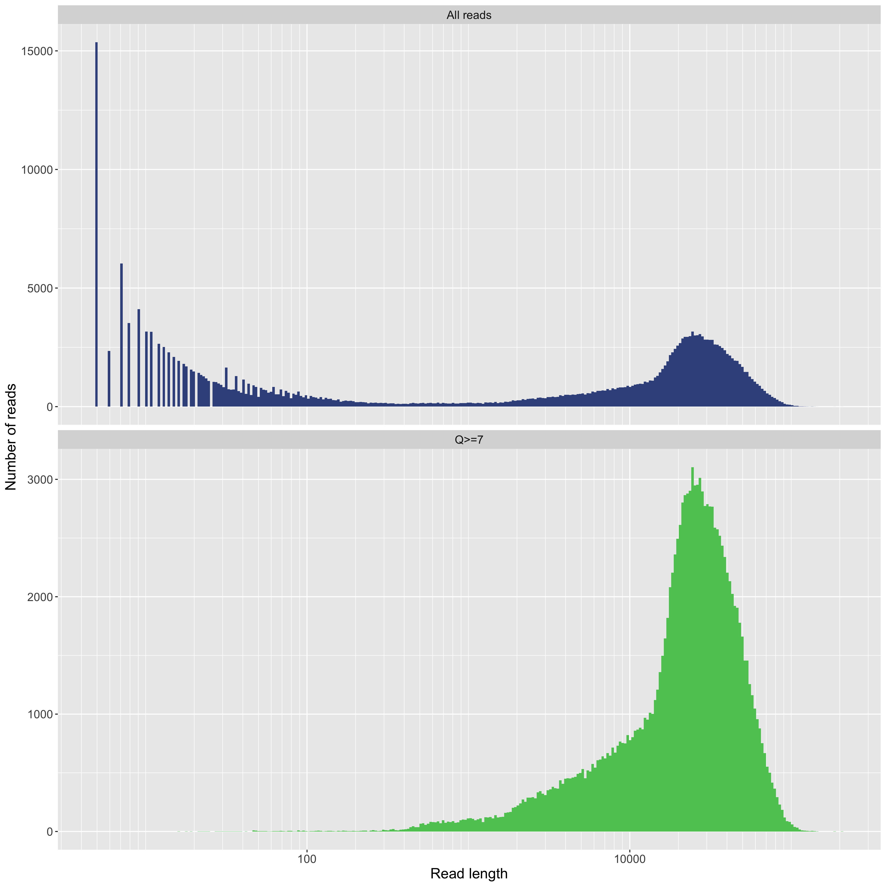

#### q_histogram.png
Mean Q score for a read (x axis) vs counts (y axis). We frequently observe a collection of 'good' reads with Q scores greater than about 7, and a collection of 'bad' reads, which Q scores that cluster around 4. Typically, one might filter the 'bad' reads out before assembly, but there's good evidence in the literature that they contain useful information if you treat them right.
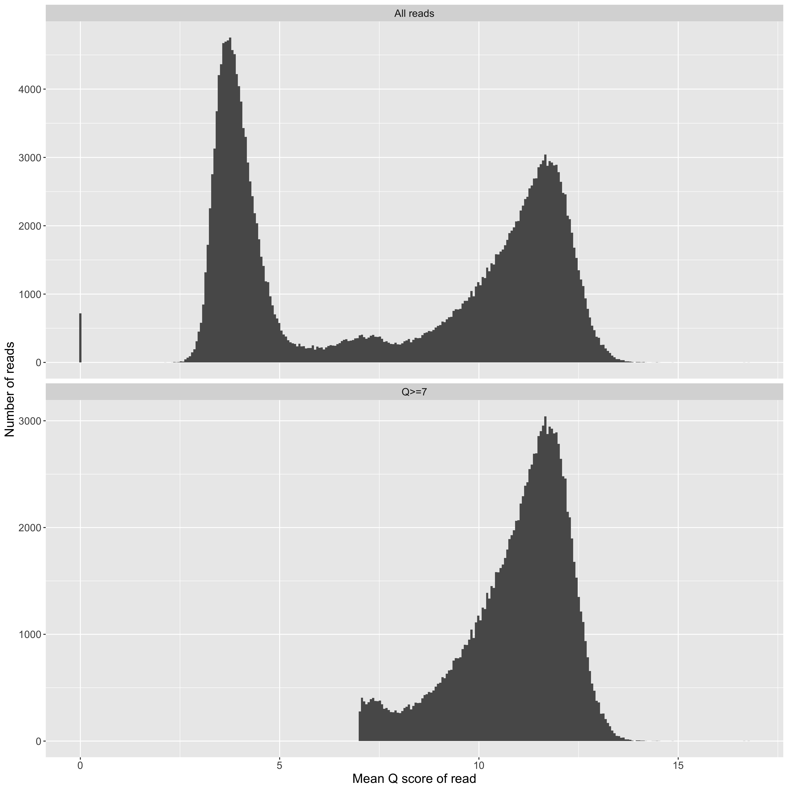

#### length_vs_q.png
Read length on a log10 scale (x axis) vs mean Q score (y axis). Points are coloured by the events per base. 'Good' reads are ~1.5 events per base, and 'bad' reads are >>1.5 events per base. We often see a group of very short, 'bad', low-quality reads. We think this is something to do with our DNA extractions, becuase not everybody gets the same thing. In this plot, the point size, transperency, and plot size are always the same no matter the input data. This facilitates comparison of these plots among flowcells - those with more reads will look darker because there will be more points. If you have a 1D2 run, there will be no colours on this plot, because Albacore doesn't report the number of events per read when it combines the two reads of a 1D2 run into a 2D read.


#### length_by_hour.png
The mean read length (y axis) over time (x axis). This let's you see if you are running out of longer reads as the run progresses. Muxes, which occur every 8 hours, are shown as red dashed lines.
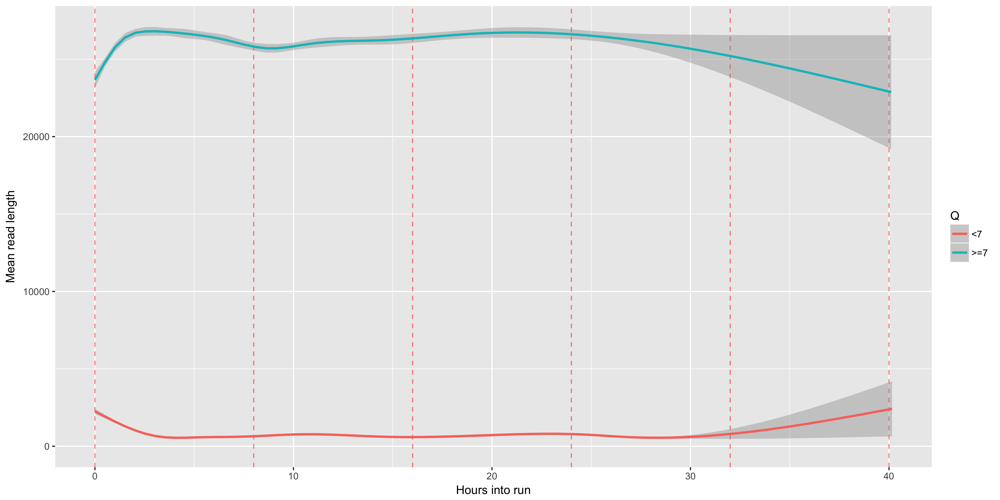

#### q_by_hour.png
The mean Q score (y axis) over time (x axis). We often see that our Q scores drop noticably over time - presumably this is a result of the pores wearing out, or the DNA accumulating damage, or both. Muxes, which occur every 8 hours, are shown as red dashed lines


#### reads_per_hour.png
The number of reads (y axis) obtained in each hour (x axis). Muxes (every 8 hours) are plotted in red dotted lines. You can typically see that each mux results in a noticable increase in the number of reads per hour. Muxes, which occur every 8 hours, are shown as red dashed lines
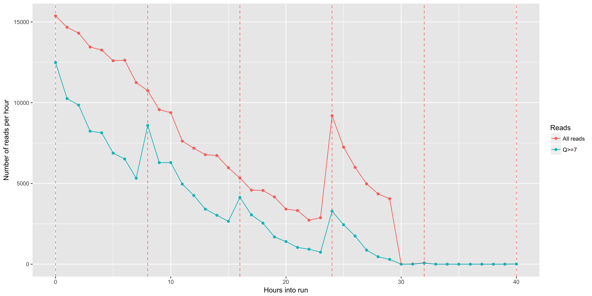

#### yield_summary.png
The total yield (y axis) for any given minimum read length (x axis). This is just like the 'reads' table in the `summary.yaml` output, but done across all read lengths up to the read length that includes 99% of the total yield. 
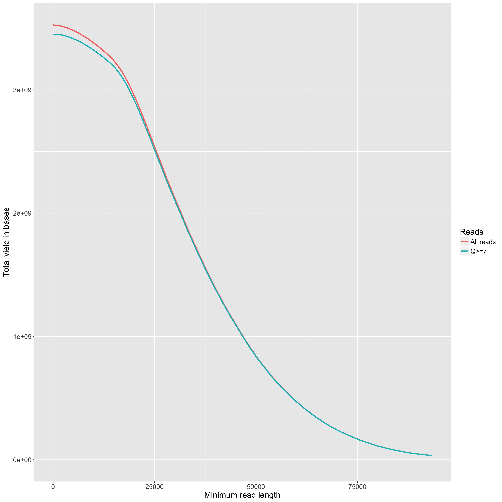

#### channel_summary.png
Histograms of total bases, total reads, mean read length, and median read length that show the variance across the 512 available channels. Repeated for all data and reads with Q>10.
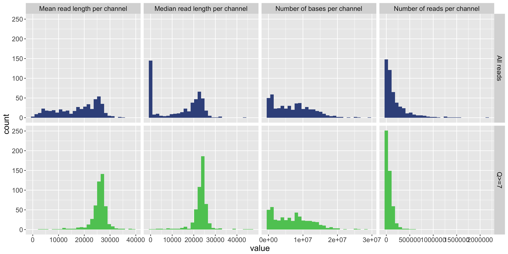

#### flowcell_overview.png
The 512 channels are laid out as on the R9.5 flowcell. Each panel of the plot shows time on the x axis, and read length on the y axis. Points are coloured by the Q score. This gives a little insight into exactly what was going on in each of your channels over the course of the run. You'll notice that in the example output for `RB7_D3` (the second plot below) you can see clearly that there was a bubble on the right-hand-side of the flowcell. The other thing of note in these plots is the frequent (and sometimes extended) periods in which some pores produce only very short, very low quality 'reads'. Our current best guess is that this is due to residual contaminants in our DNA extractions blocking the pores. A blocked pore looks like a change in current. And if the blockage is persistent (e.g. a large molecule just sitting blocking the pore, occasionally letting some current through) this could produce exactly this kind of pattern. Hopefully you don't see this in your samples. We work with plants, so this is the best we've been able to do so far.


### Output for the combined data

9 files are produced that summarise the combined data across all flowcells. Examples are in the `example_output/combinedQC/` folder. 

#### summary.yaml
As above, but for all data combined across flowcells. Useful for knowing where your project is up to so far.

#### combined_length_histogram.png
Read length, on a log10 scale, from the combined data on the X axis, and read counts on the Y axis.
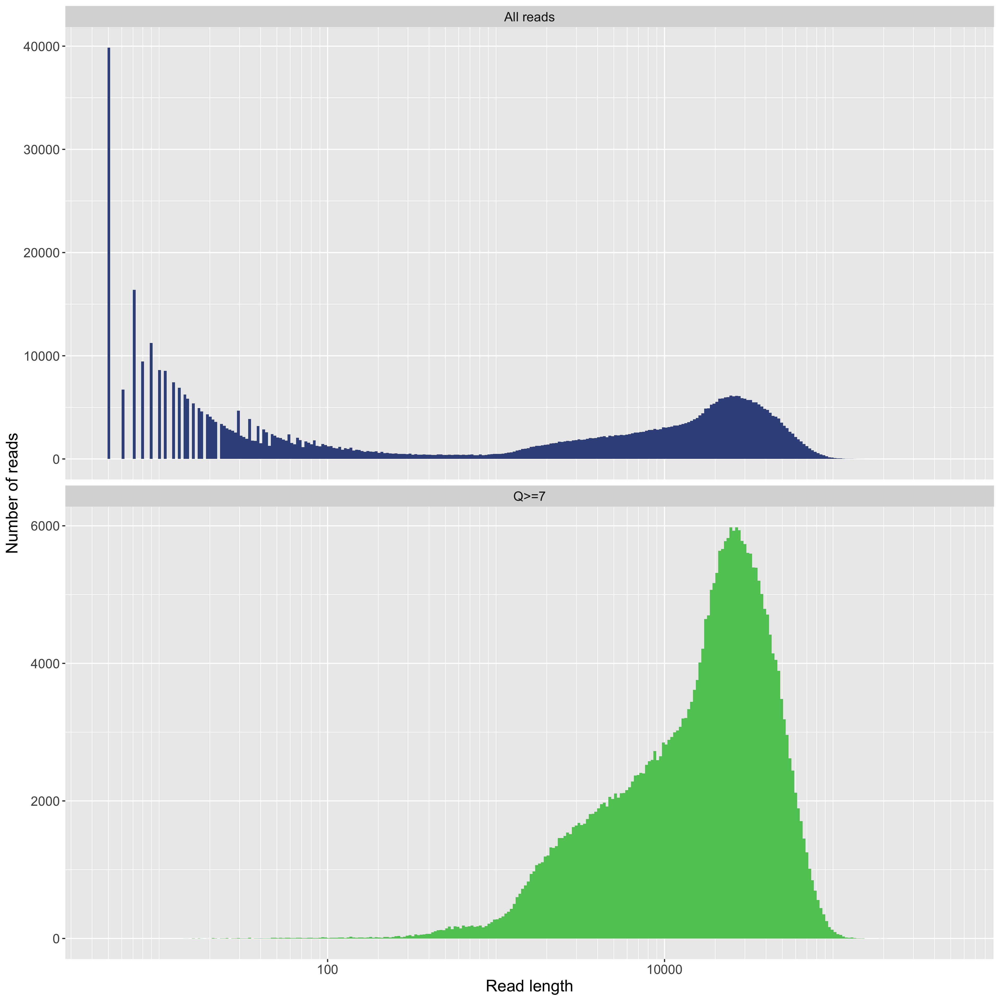

#### combined_q_histogram.png
Mean Q score for a read on the X axis, and counts on the Y axis. From the combined data across all flowcells.
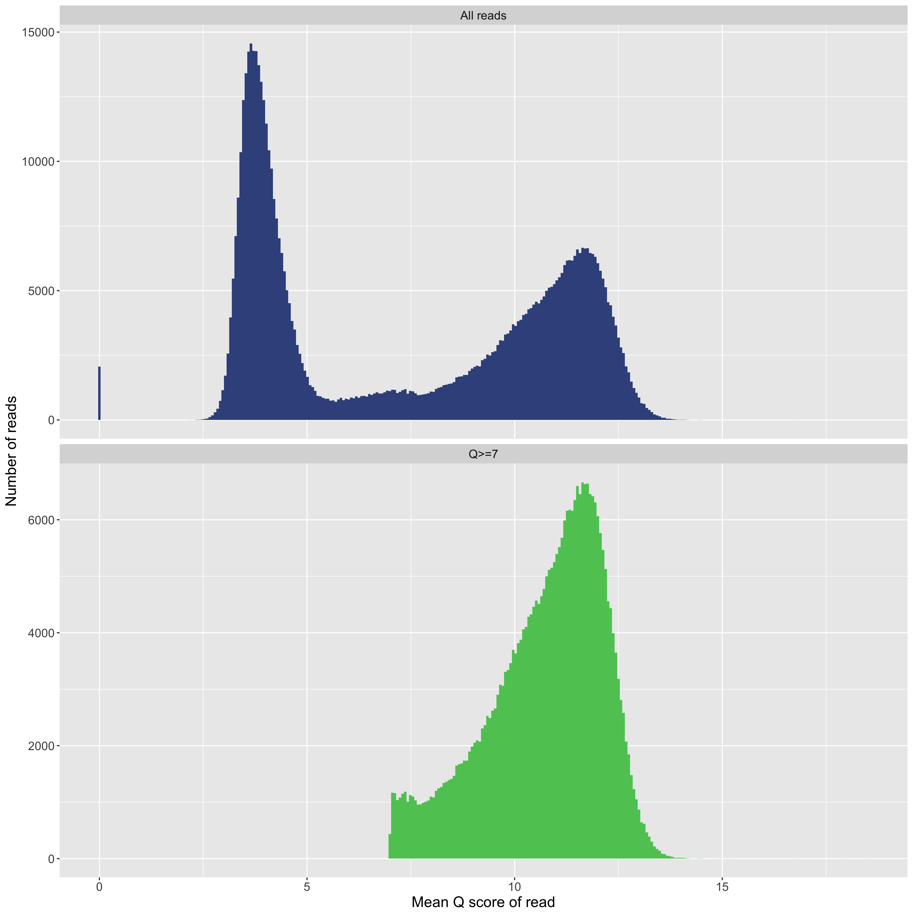

#### combined_yield_summary.png
The total yield (y axis) for any given minimum read length (x axis), from all data combined. As above, the maximum read length in the plot is the one that includes 99% of the total yield.
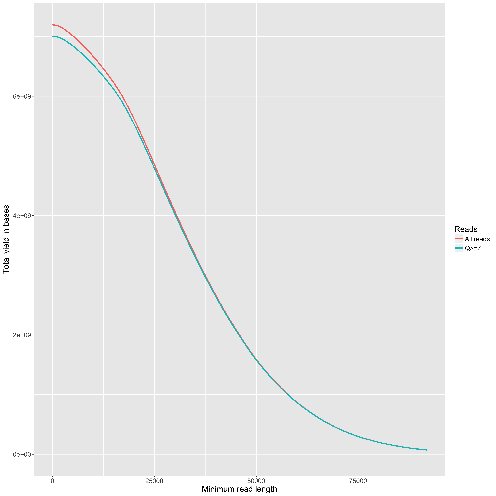

#### length_distributions.png
Read length on a log10 scale (x axis) vs density (y axis). One line per flowcell. This allows for comparison of read length distributions across flowcells, but it's hard to use these kinds of plots to compare yields. For that, use the `yield_summary.png` plot (see below).
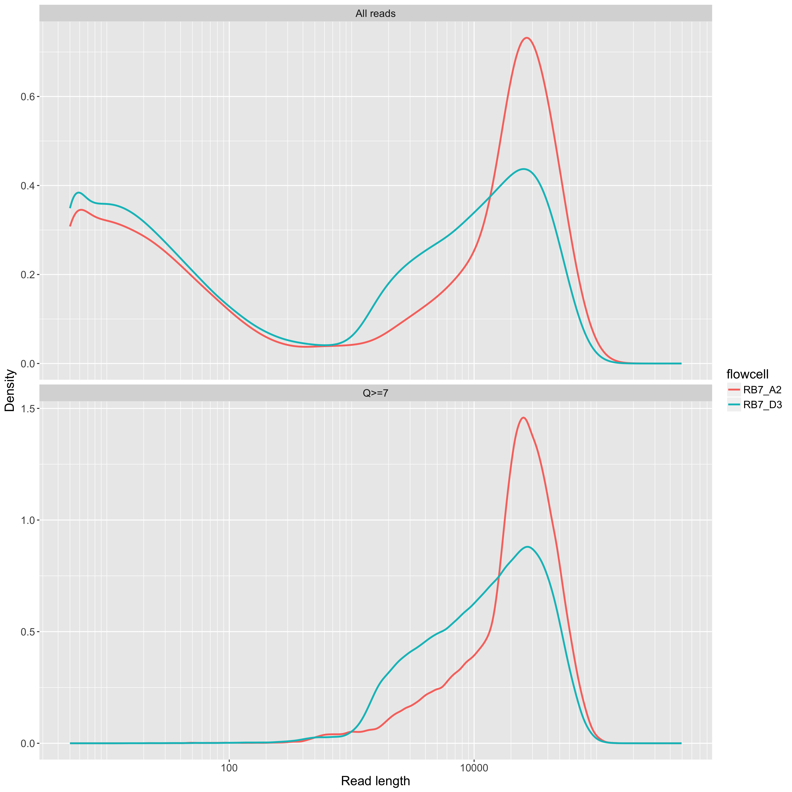

#### q_distributions.png
Mean Q score of a read (x axis) vs density (y axis). One line per flowcell. 
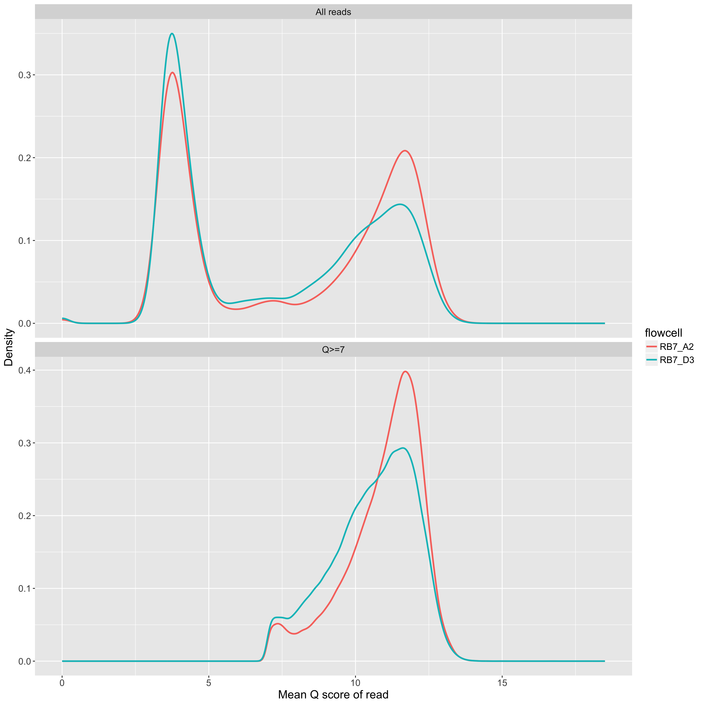

#### length_by_hour.png
The readlength (y axis) over time (x axis). Muxes, which occur every 8 hours, are shown as red dashed lines
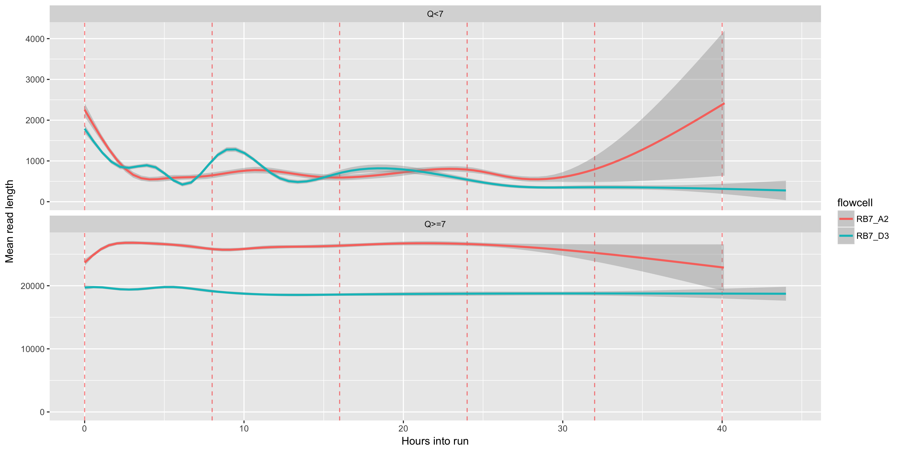

#### q_by_hour.png
The mean Q score accross reads (y axis) over time (x axis). Muxes, which occur every 8 hours, are shown as red dashed lines
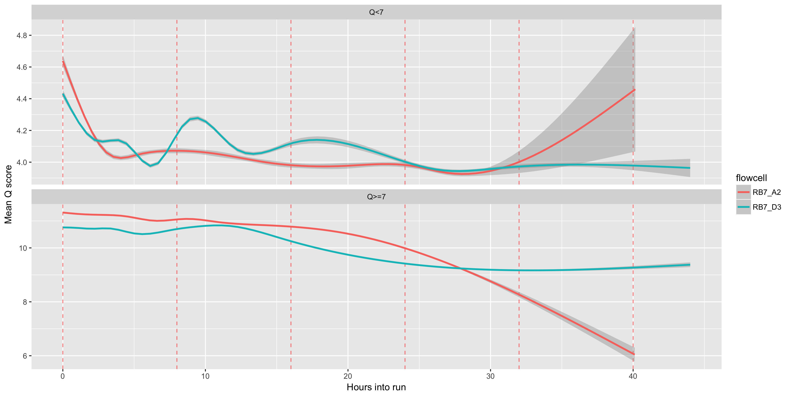

#### yield_summary.png
The total yield (y axis) for any given minimum read length (x axis). One line per flowcell. The maximum read length in the plot is the one that includes 99% of the total yield for the flowcell with the highest total yield. The comparison of the two flowcells below is interesting. For the one in red, we used a blue-pippen for size selection, removing fragments <20KB. For the one in blue, we used a bead-based size selection which removes just the smallest fragments <~1KB. The result is that the two flowcells have very similar overall yields, but quite different yield profiles. 
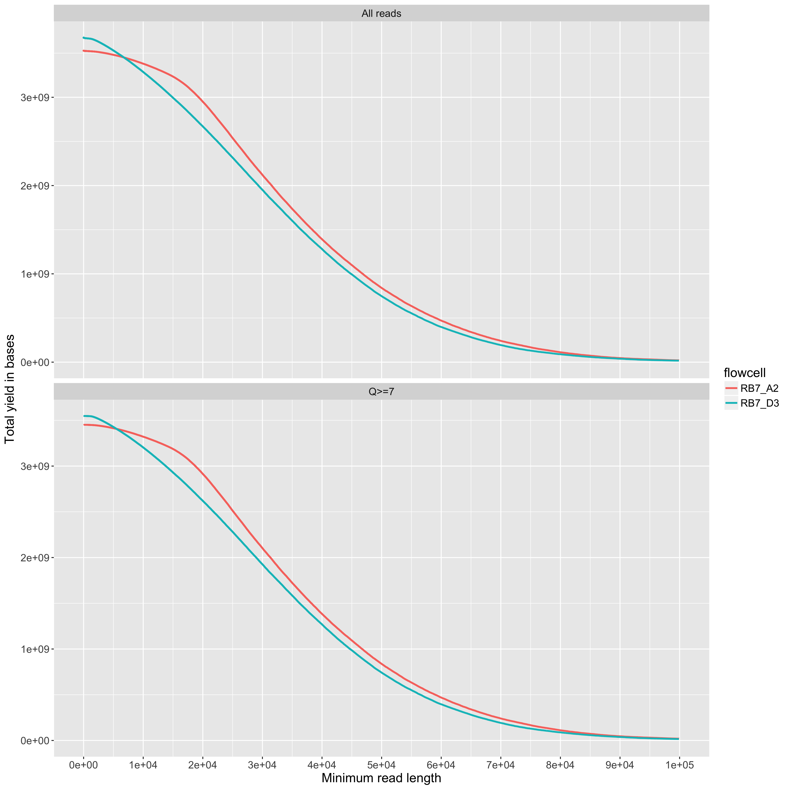
