# Fast and effective quality control for MinION and PromethION sequencing data

- [What and Why?](https://github.com/roblanf/minion_qc#what-and-why)
- [Quick start](https://github.com/roblanf/minion_qc#quick-start)
- [Commandline options](https://github.com/roblanf/minion_qc#commandline-options)
- [Installation](https://github.com/roblanf/minion_qc#installation)
    - [Dependencies](https://github.com/roblanf/minion_qc#dependencies)
- [Output details for MinION](https://github.com/roblanf/minion_qc#output-details-for-minion)
  - [Analysing a single flowcell](https://github.com/roblanf/minion_qc#analysing-a-single-flowcell)
  - [Analysing multiple flowcells](https://github.com/roblanf/minion_qc#analysing-multiple-flowcells)
- [Output details for PromethION](https://github.com/roblanf/minion_qc#output-details-for-promethion)

## Citation

If you use MinIONQC in your published work, please cite  

R Lanfear, M Schalamun, D Kainer, W Wang, B Schwessinger (2018). MinIONQC: fast and simple quality control for MinION sequencing data, Bioinformatics, bty654
https://doi.org/10.1093/bioinformatics/bty654

## What and Why?

MinIONQC gives you a range of diagnostic plots and data for quality control of sequencing data from Oxford Nanopore's MinION and PromethION sequencer. 

There are lots of tools that do related things, but they mostly focus on getting data out of the fastq or fast5 files, which is slow and computationally intensive. The benefit of MinIONQC is that it works directly with the `sequencing_summary.txt` files produced by ONT's Albacore or Guppy base callers. This makes `MinIONQC` a lot quicker than most other things out there, and crucially allows the quick-and-easy comparison of data from multiple flowcells. For example, it takes about a minute to analyse a 4GB flowcell using a single processor on my laptop.

If you don't already have `sequencing_summary.txt` files for your data, you can produce them very quickly with ONT's Albacore or Guppy basecallers.

## Quick start

The input for the script is one or more `sequencing_summary.txt` files produced by ONT's Albacore or Guppy basecallers, based on data from one or more MinION or PromethION flowcells. MinIONQC autodetects which kind of flowcell your data came from.

#### One `sequencing_summary.txt` file

To run it on one `sequencing_summary.txt` file, just point it to a single `sequencing_summary.txt` file like this:

```
Rscript MinIONQC.R -i path/to/sequencing_summary.txt
```

#### Multiple `sequencing_summary.txt` files in different directories

To run it on a directory with multiple `sequencing_summary.txt` files, make sure that each file is called  `sequencing_summary.txt`, and is contained in a separate directory with a unique name (this will be used as the name of the flowcell), then:

```shell
Rscript MinIONQC.R -i path/to/parent_directory
```

The script will simply look for all `sequencing_summary.txt` files recursively in the parent directory, and incorporate all of them. 

* `MinIONQC.R`: path to this script
* `path/to/parent_directory`: path to an input directory that contains one or more `sequencing_summary.txt` files in sub-directories

You'll see a series of plots in the output directory, and a YAML file that describes your output (you can open this in any text editor). These, and other command line options, are described below.


#### Multiple `sequencing_summary.txt` files in the same directory

PromethION users will often have a collection of `sequencing_summary.txt` files from a single run, named something like:

```
sequencing_summary_FAM92215_1a854df33.txt
sequencing_summary_FAM92215_2a473djj2.txt
sequencing_summary_FAM94555_r11jee78q.txt
```

Typically these are all from the same run, it's just that the PromethION outputs the basecalls into a series of files as it goes. 

To use MinIONQC with these files, simply `cat` together the files you want to join first into a single file, then run MinIONQC. For example, if you wanted to join all of these files together for an analysis, you would simply do the following:

```
cat sequencing_summary_* > sequencing_summary.txt
Rscript MinIONQC.R -i sequencing_summary.txt
```

The first line just joins all the partial files together. The order you join them does not matter. 

Note: for direct RNA runs, any reads from the control RNA sequence (i.e. anything in your summary file labelled "YHR174W") are removed prior to analysis.


## Commandline options

Can be viewed by typing `Rscript MinIONQC.R -h` at the commandline.

```
Options:
  -h, --help
    Show this help message and exit

  -i INPUT, --input=INPUT
    Input file or directory (required). Either a full path to a sequence_summary.txt file, or a full path to a directory containing one or more such files. In the latter case the directory is searched recursively.

  -o OUTPUTDIRECTORY, --outputdirectory=OUTPUTDIRECTORY
    Output directory (optional, default is the same as the input directory). If a single sequencing_summary.txt file is passed as input, then the output directory will contain just the plots associated with that file. If a directory containing more than one sequencing_summary.txt files is passed as input, then the plots will be put into sub-directories that have the same names as the parent directories of each sequencing_summary.txt file

  -q QSCORE_CUTOFF, --qscore_cutoff=QSCORE_CUTOFF
    The cutoff value for the mean Q score of a read (default 7). Used to create separate plots for reads above and below this threshold

  -p PROCESSORS, --processors=PROCESSORS
    Number of processors to use for the anlaysis (default 1). Only helps when you are analysing more than one sequencing_summary.txt file at a time

  -s SMALLFIGURES, --smallfigures=SMALLFIGURES
    TRUE or FALSE (the default). When true, MinIONQC will output smaller figures, e.g. suitable for publications or presentations. The default is to produce larger figures optimised for display on screen. Some figures just require small text, and cannot be effectively resized.

  -c COMBINED-ONLY, --combined-only=COMBINED-ONLY
    TRUE or FALSE (the default). When true, MinIONQC will only produce the combined report, it will not produce individual reports for each flowcell.

  -f FORMAT, --format=FORMAT
    A string in quotes, to set the output format of the plots. 'png' (the default) or any of 'pdf', 'ps', 'jpeg', 'tiff', 'bmp' are supported. 'png' is recommended and is thoroughly tested. The 'pdf' option may be useful if you have a system without X11 installed, because PNG files require X11 but PDF files do not. Other options are there for convenience.


```

## Installation

The script requires minimal installation: you just need the script, and a few R packages. 

**To get the script**

You can just download or copy/paste the raw R script from here: https://raw.githubusercontent.com/roblanf/minion_qc/master/MinIONQC.R

Or you can get it with `curl` or `wget`:

```shell
curl https://raw.githubusercontent.com/roblanf/minion_qc/master/MinIONQC.R > MinIONQC.R

wget https://raw.githubusercontent.com/roblanf/minion_qc/master/MinIONQC.R -O MinIONQC.R
```

**To get the script as well as the example input and output**

Download the `.zip` or `.tar.gz` file from here: https://github.com/roblanf/minion_qc/releases/latest/

#### Dependencies

To run the script, you will need a recent version of R, and the following packages. To install the right packages, just start up R and copy/paste the code below.

```R
install.packages(c("data.table", 
                   "futile.logger",
                   "ggplot2",
                   "optparse",
                   "plyr",
                   "readr",
                   "reshape2",
                   "scales",
                   "viridis",
                   "yaml"))
```

#### Running the examples

If you want to run the example input, one option is to change directories to the file containing the `MinonQC.R` script and type:

```
Rscript MinIONQC.R -i example_input_minion -o my_example_output_minion -p 2 
```

## Output details for MinION
The following output was created by running the script on the example input files, which contains data from two flowcells from our lab.

```
Rscript MinIONQC.R -i example_input_minion -o example_output_minion -s TRUE -p 2
```

This runs the analysis with two processors, and produces smaller plots suitable for presentations or papers (where possible). The defualt (i.e. removing the `-s` option above) is to produce larger plots designed for viewing on full size monitors.

Two kinds of output are produced. Output for each flowcell, and then additional output for the combined flowcells to allow for comparison. The script will produce 10 files to describe each flowcell, and 9 files to describe all flowcells combined (if you have analysed more than one flowcell). I explain each of these files below, with examples from the `example_output_minion/RB7_A2/` folder for a single flowcell, and examples from the `example_output_minion/combinedQC/` folder for multiple flowcells. 

There are two main colour schemes used in the plots:

* **Q Scores**: Green is a high Q score, and blue is a low Q score. These are either represented as a categorical variable where blue is all of your reads and green is the reads above your Q score cutoff (the default is Q>=7), or as a continuous variable that runs from blue (bad Q score) to green (good Q score). 
* **Flowcells**: on plots that show data from more than one flowcell, each flowcell is represented by a unique colour. Typically there are two panels in these plots: all reads are shown on the top panel, and the reads that pass your quality score cutoff (`-q` at the commandline) are shown on the bottom panel.

### Analysing a single flowcell

#### summary.yaml

A text summary of the data in yaml format (opens in any text editor, but can also be read by any coding language). One of these is produced for each flowcell, and one for the combined flowcells. The statstics are repeated for all of the data, and for the data above the Q threshold (which is 7 by default, but can be changed with `-q` at the commandline).

```yaml
input file: example_input/RB7_A2/sequencing_summary.txt
All reads:
  total.gigabases: 3.527993
  total.reads: 238421
  N50.length: 34625.0
  mean.length: 14797.3
  median.length: 5852.0
  max.length: 208407.0
  mean.q: 7.9
  median.q: 9.0
  reads:
    '>10kb': 108102
    '>20kb': 80309
    '>50kb': 13325
    '>100kb': 181
    '>200kb': 1
    '>500kb': 0
    '>1m': 0
    ultralong: 390.0
  gigabases:
    '>10kb': 3.3802968
    '>20kb': 2.949691
    '>50kb': 0.8406423
    '>100kb': 0.0199968
    '>200kb': 0.0002084
    '>500kb': 0.0e+00
    '>1m': 0.0e+00
    ultralong: 0.0399325
Q>=7:
  total.gigabases: 3.4512843
  total.reads: 131847
  N50.length: 34965.0
  mean.length: 26176.4
  median.length: 23673.0
  max.length: 208407.0
  mean.q: 10.9
  median.q: 11.2
  reads:
    '>10kb': 105306
    '>20kb': 79150
    '>50kb': 13274
    '>100kb': 180
    '>200kb': 1
    '>500kb': 0
    '>1m': 0
    ultralong: 388.0
  gigabases:
    '>10kb': 3.3211363
    '>20kb': 2.9143651
    '>50kb': 0.8375402
    '>100kb': 0.0198897
    '>200kb': 0.0002084
    '>500kb': 0.0e+00
    '>1m': 0.0e+00
    ultralong: 0.0397338
notes: ultralong reads refers to the largest set of reads with N50>100KB


```

#### length_histogram.png
Read length on a log10 scale (x-axis) vs counts (y-axis). This is a standard plot for long-read sequencing. Although it's obviously useful, it still doesn't tell you how much data (i.e. your total yield) you have for reads above a given length though. For that, see the `yield_by_length` and `yield_over_time` plots. Of note in our data are the large number of very short reads. We don't think these are actually DNA fragments. Instead, we think they are contaminant molecules blocking pores (see below for more on this). In any case, it is exactly this kind of observation that led us to continue developing these QC tools. Knowing what's holding your performance back is key to getting better. 
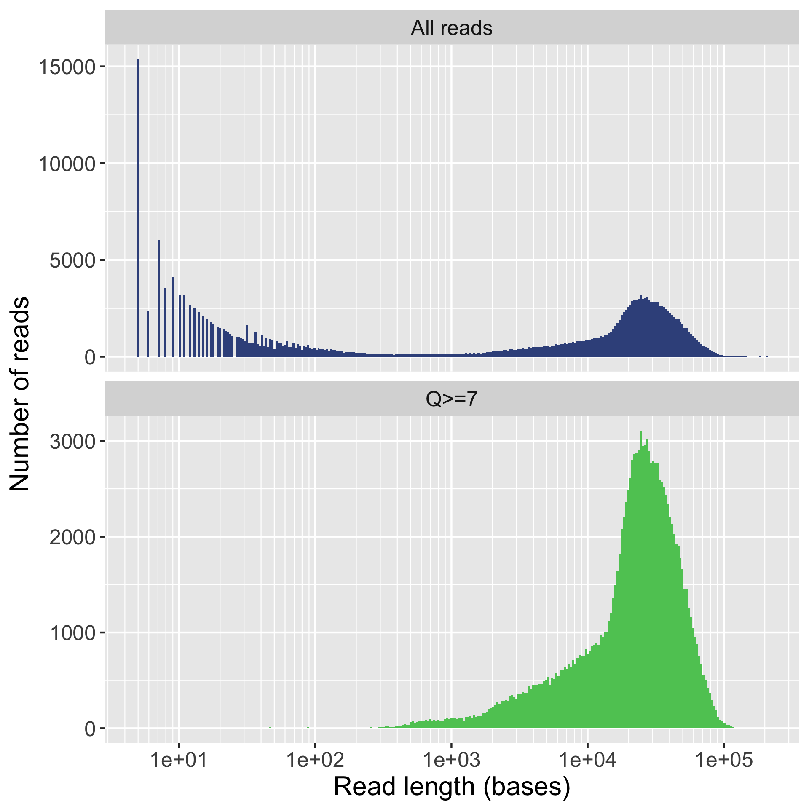

#### q_histogram.png
Mean Q score for a read (x-axis) vs counts (y-axis). We frequently observe a collection of 'good' reads with Q scores greater than about 7, and a collection of 'bad' reads, which Q scores that cluster around 4. Typically, one might filter the 'bad' reads out before assembly, but there's good evidence in the literature that they contain useful information if you treat them right.
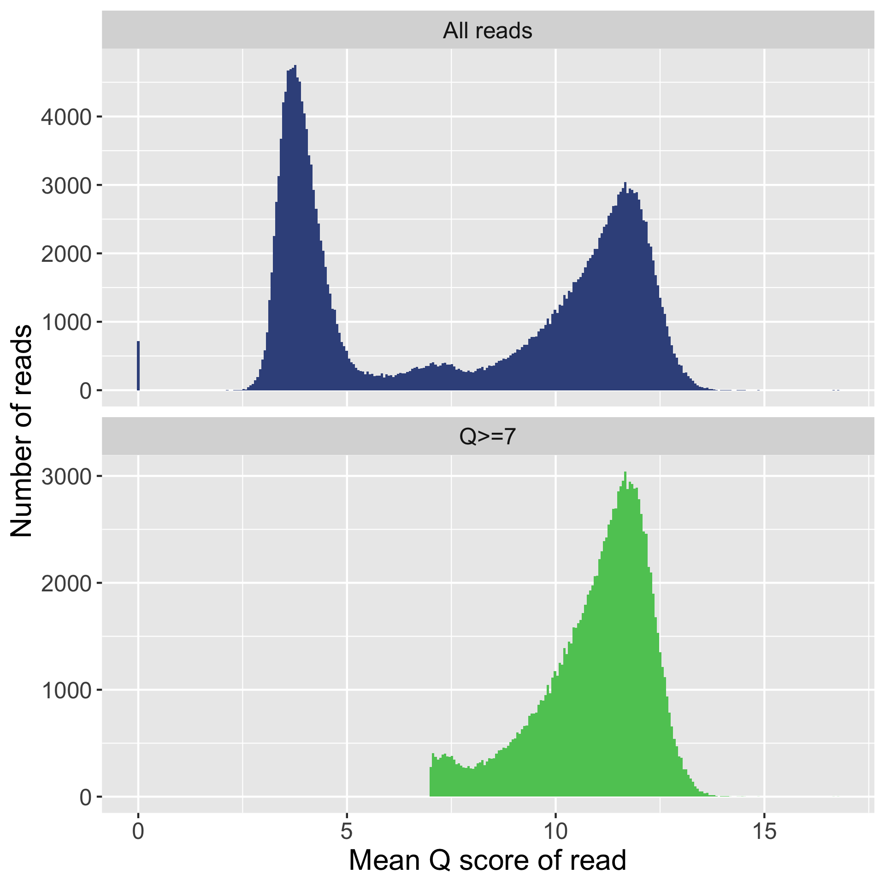

#### length_vs_q.png
Read length on a log10 scale (x-axis) vs mean Q score (y-axis). Points are coloured by the events per base. 'Good' reads are ~1.5 events per base, and 'bad' reads are >>1.5 events per base. We often see a group of very short, 'bad', low-quality reads. We think this is something to do with our DNA extractions, becuase not everybody gets the same thing. In this plot, the point size, transperency, and plot size are always the same no matter the input data. This facilitates comparison of these plots among flowcells and labs - those with more reads will look darker because there will be more points. If you have a 1D2 run, there will be no colours on this plot, because Albacore doesn't report the number of events per read when it combines the two reads of a 1D2 run into a single read.
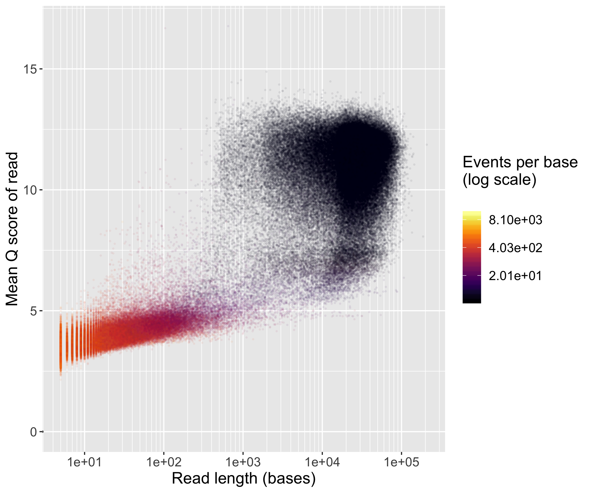

#### length_by_hour.png
The mean read length (y-axis) over time (x-axis). This let's you see if you are running out of longer reads as the run progresses. Muxes, which occur every 8 hours, are shown as red dashed lines.
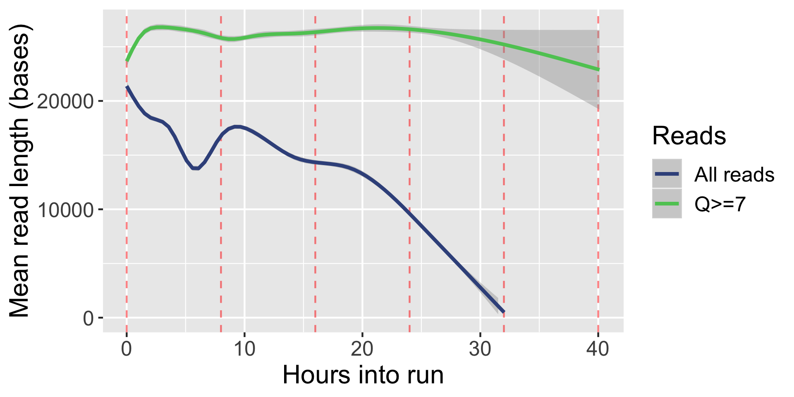

#### q_by_hour.png
The mean Q score (y-axis) over time (x-axis). We often see that our Q scores drop noticably over time - presumably this is a result of the pores wearing out, or the DNA accumulating damage, or both. Muxes, which occur every 8 hours, are shown as red dashed lines
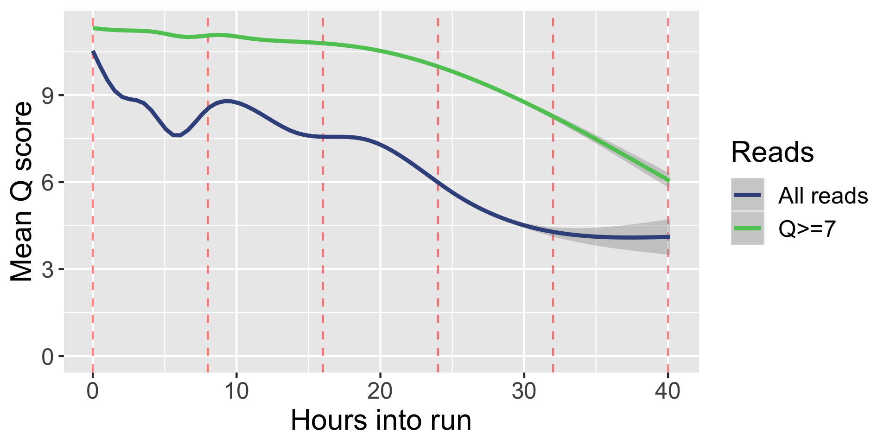

#### reads_per_hour.png
The number of reads (y-axis) obtained in each hour (x-axis). Muxes (every 8 hours) are plotted as red dashed lines. You can typically see that each mux results in a noticable increase in the number of reads per hour. 
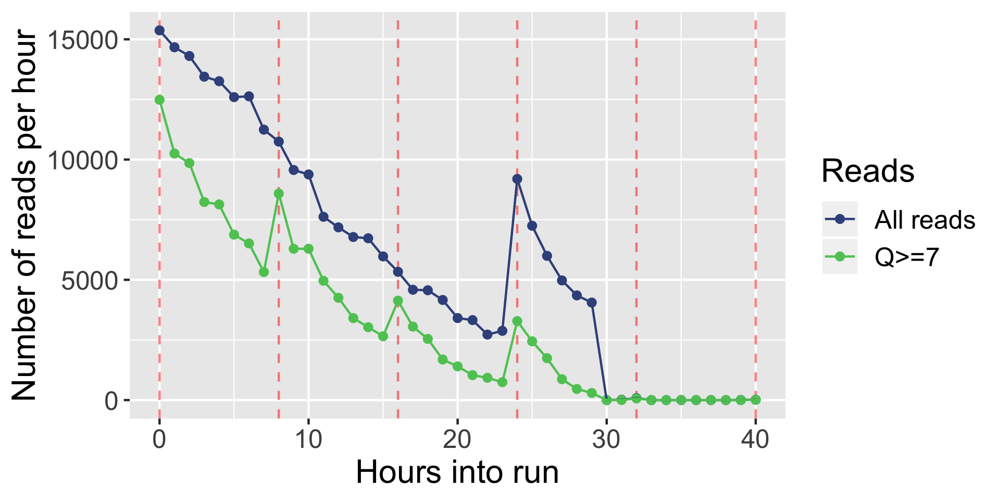

#### yield_by_length.png
The total yield in bases (y-axis) for any given minimum read length (x-axis). This is just like the 'reads' table in the `summary.yaml` output, but done across all read lengths up to the read length that includes 99% of the total yield. For example, to read off the amount of bases you have sequenced from reads of at least 25KB, just go up from 25KB on the x-axis to the line, then left to the y-axis, and you should get an answer of ~2.5GB. This can be particularly useful when your aim is to achieve a particular total yield of reads longer than some predefined length from a series of flowcells. This is often the case for genome sequencing projects. 
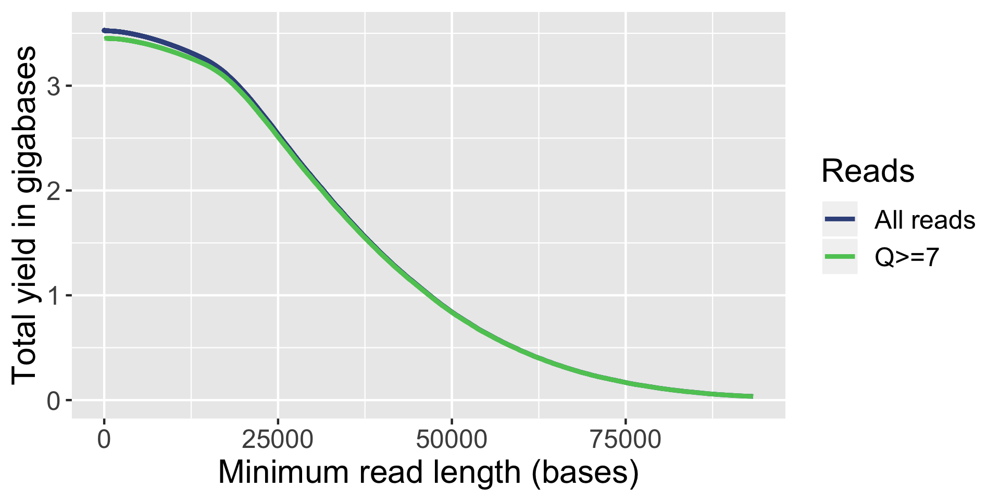


#### yield_over_time.png
The total yield (y-axis) over the time that the flowcell was run. This can help to identify any issues that occurred during the run of a particular flowcell. Muxes are shown as dashed red lines. This one looks fine, and shows the expected boosts from each mux.  
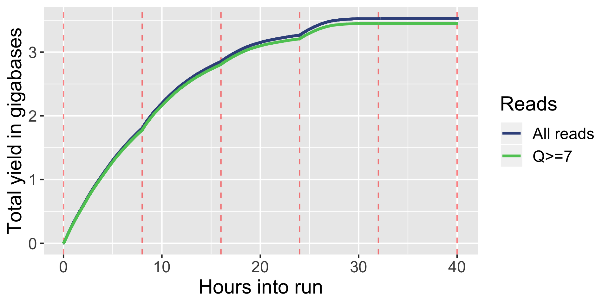


#### channel_summary.png
Histograms of total bases, total reads, mean read length, and median read length that show the variance across the 512 available channels. Repeated for all data and reads with Q>10.
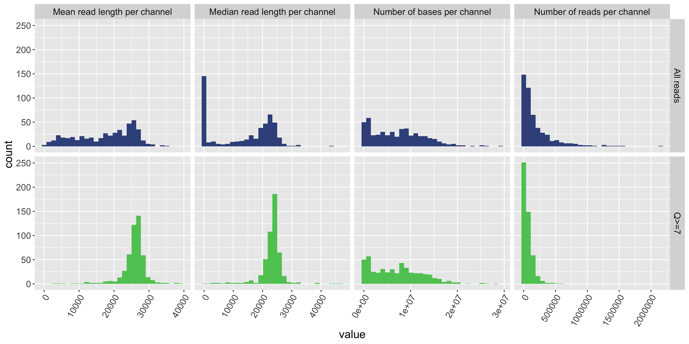


#### flowcell_overview.png
The 512 channels are laid out as on the R9.5 flowcell. Each panel of the plot shows time on the x-axis, and read length on the y-axis. Points are coloured by the Q score. This gives a little insight into exactly what was going on in each of your channels over the course of the run. You'll notice that in the example output for `RB7_D3` (the second plot below) you can see clearly that there was a bubble on the right-hand-side of the flowcell. The other thing of note in these plots is the frequent (and sometimes extended) periods in which some pores produce only very short, very low quality 'reads'. Our current best guess is that this is due to residual contaminants in our DNA extractions blocking the pores. A blocked pore looks like a change in current. And if the blockage is persistent (e.g. a large molecule just sitting blocking the pore, occasionally letting some current through) this could produce exactly this kind of pattern. Hopefully you don't see this in your samples. We work with plants, so this is the best we've been able to do so far.


#### gb_per_channel_overview.png
This is really just a summary of the flowcell_overview plot. It shows the number of gigabases sequenced for each channel on the flowcell, with channels organised according to their physical distribution on the flowcell. The two panels show all reads (left) and all reads above your chosen Q score cutoff (right).


### Analysing multiple flowcells

9 files are produced that summarise the combined data across all flowcells. Examples are in the `example_output_minion/combinedQC/` folder. 

#### summary.yaml
As above, but for all data combined across flowcells. Useful for knowing where your project is up to so far.

#### combined_length_histogram.png
Read length, on a log10 scale, from the combined data on the x-axis, and read counts on the y-axis.
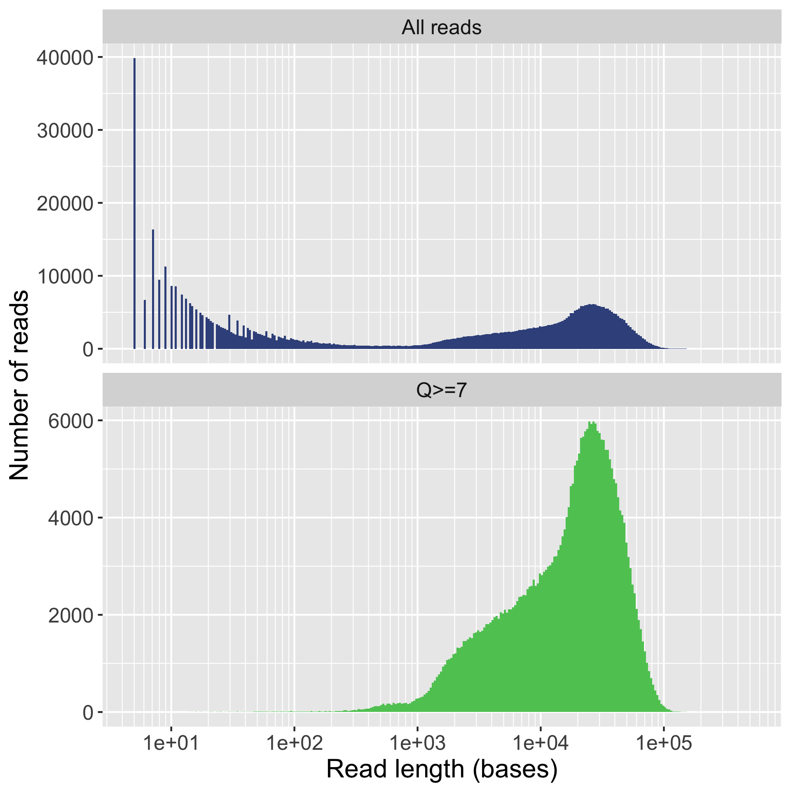

#### combined_q_histogram.png
Mean Q score for a read on the x-axis, and counts on the y-axis. From the combined data across all flowcells.
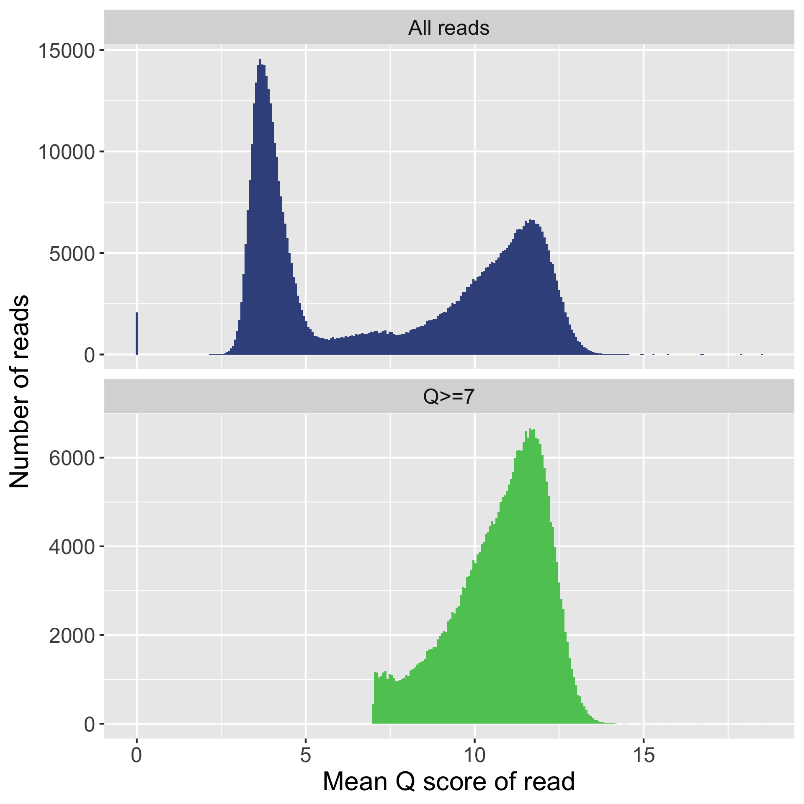

#### combined_yield_by_length.png
The total yield (y-axis) for any given minimum read length (x-axis), from all data combined. As above, the maximum read length in the plot is the one that includes 99% of the total yield.
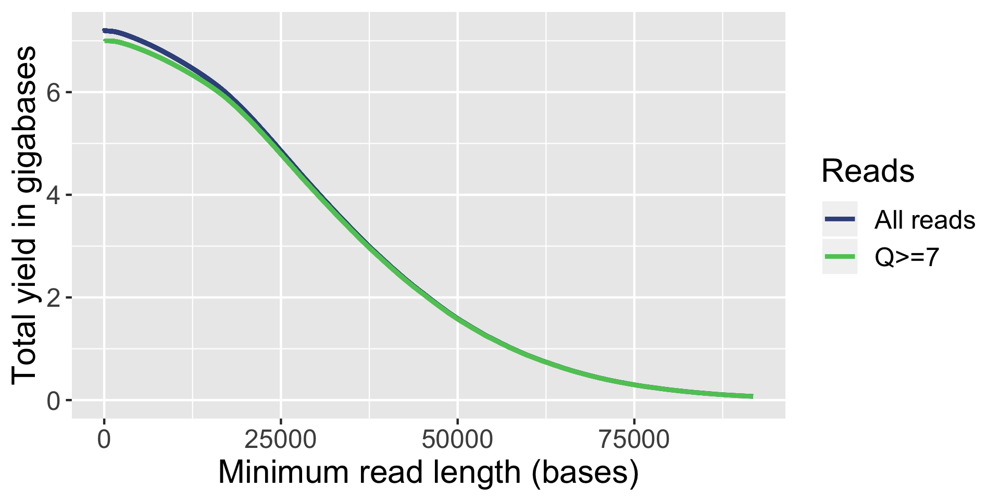

#### length_distributions.png
Read length on a log10 scale (x-axis) vs density (y-axis). One line per flowcell. This allows for comparison of read length distributions across flowcells, but it's hard to use these kinds of plots to compare yields, because the height of a plot depends on how much of the read distribution focussed in that area. To compare yields more directly, use the `yield_by_length` and `yield_over_time` plots.
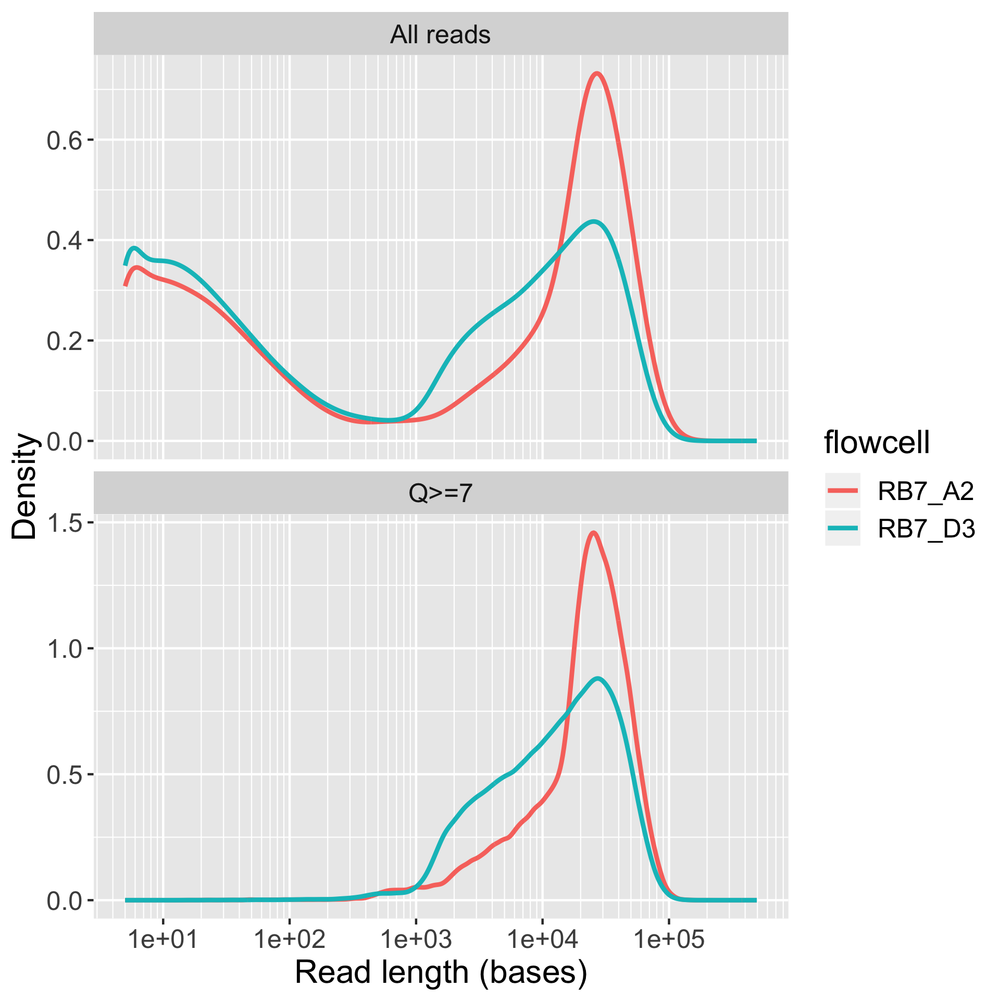

#### q_distributions.png
Mean Q score of a read (x-axis) vs density (y-axis). One line per flowcell. 
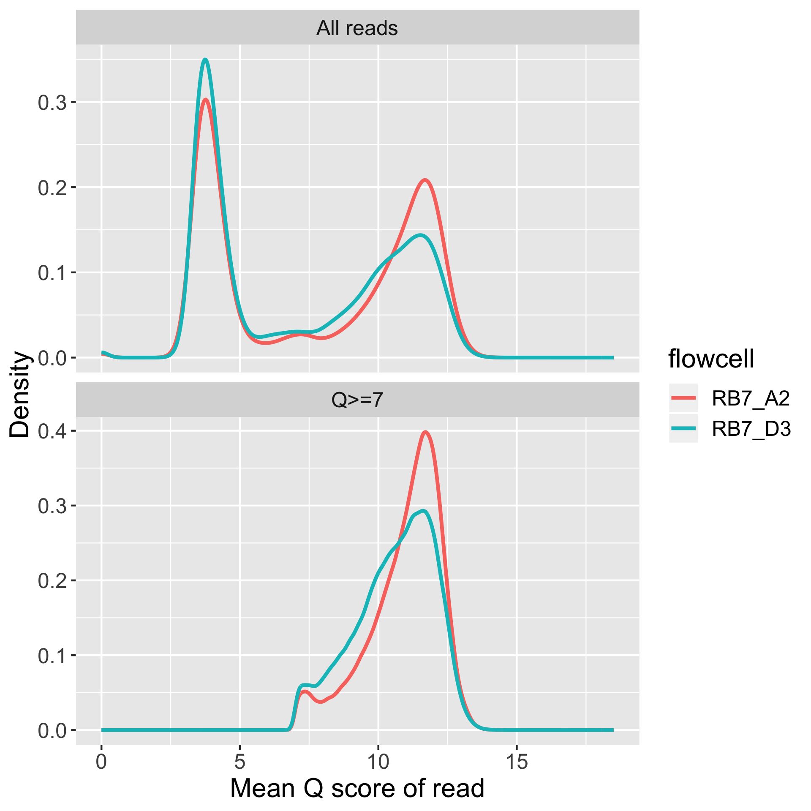

#### length_by_hour.png
The readlength (y-axis) over time (x-axis). Muxes, which occur every 8 hours, are shown as red dashed lines
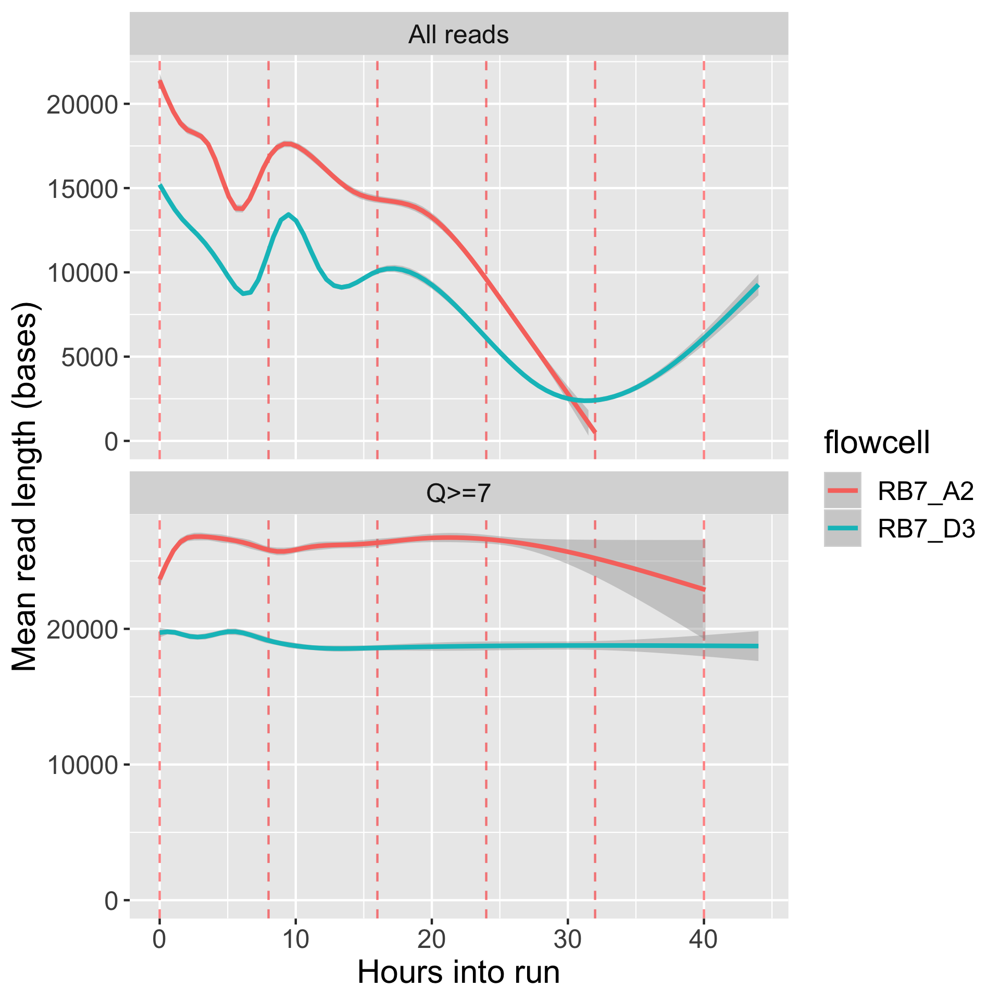

#### q_by_hour.png
The mean Q score accross reads (y-axis) over time (x-axis). Muxes, which occur every 8 hours, are shown as red dashed lines
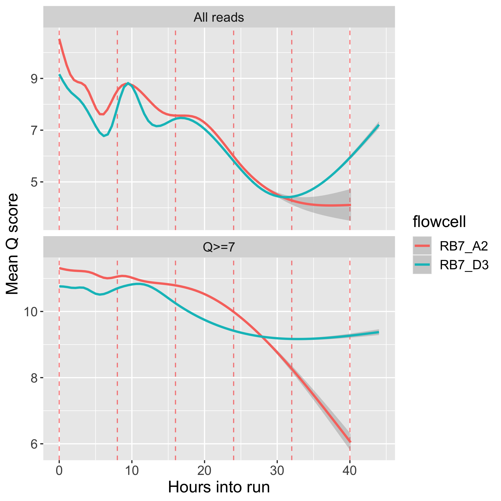

#### yield_by_length.png
The total yield (y-axis) for any given minimum read length (x-axis). Each flowcell has its own colour. All reads are in the top panel, and just the reads above your Q cutoff are in the bottom panel. This is just like the 'reads' table in the `summary.yaml` output, but done across all read lengths up to the read length that includes 99% of the total yield for the flowcell with the highest total yield. The comparison of the two flowcells below shows the effect of using a blue pippen for size selection, removing fragments <20KB. For the one in blue, we used a bead-based size selection which removes just the smallest fragments <~1KB. The result is that the two flowcells have very similar overall yields, but quite different  profiles. 
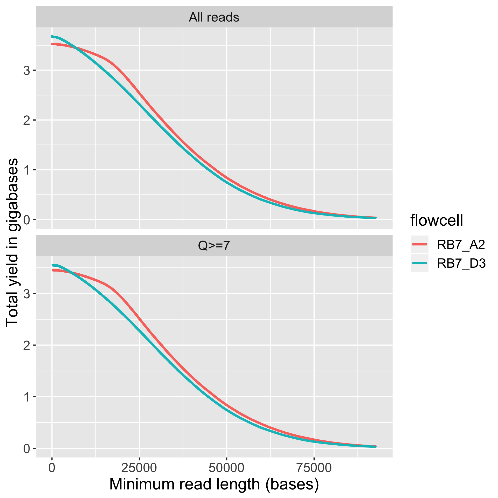

#### yield_over_time.png
The total yield (y-axis) over the time that the flowcell was run (x-axis). This can help to identify any issues that occurred during the run of a particular flowcell. Muxes are shown as dashed red lines. This plot shows that something happened to flowcell RB7_D3 at ~17 hours, which stopped it from working until the next mux at 24 hours. 
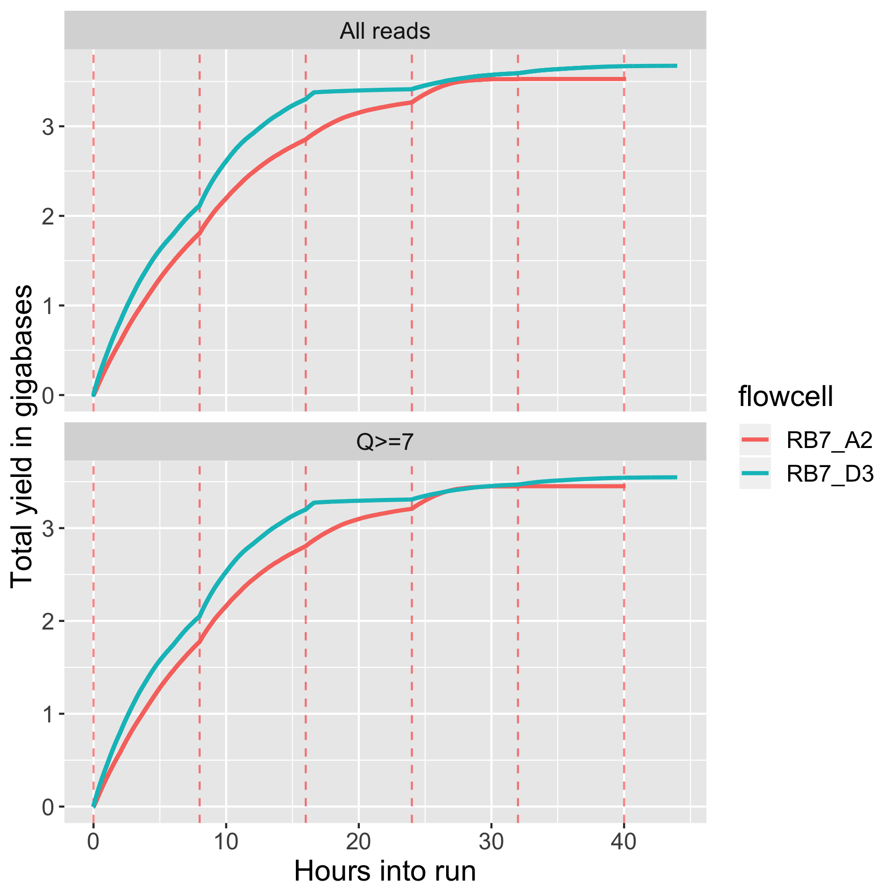


## Output details for PromethION

Most of the plots and files for a PromethION flowcell are the same as for a MinION flowcell. However, given the huge volumes of data produced by a single PromethION flowcell, there are a couple of important differences. Below I just show the plots that differ from those described above. One thing to note is that the flowcell overview plot will not be made - it's just not possible put a point for each read on one plot in a way that is actually useful.

#### gb_per_channel_overview.png
Number of gigabases sequenced for each channel on the flowcell, with channels organised according to their physical distributino on the flowcell. The two panels show all reads (top) and all reads above your chosen Q score cutoff (bottom).
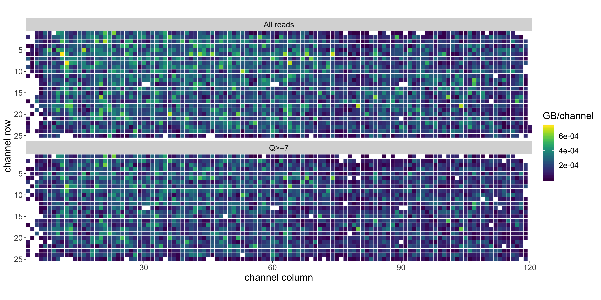

#### length_vs_q.png
Read length on a log10 scale (x-axis) vs mean Q score (y-axis). The colour shows the number of reads in each region of the plot. 
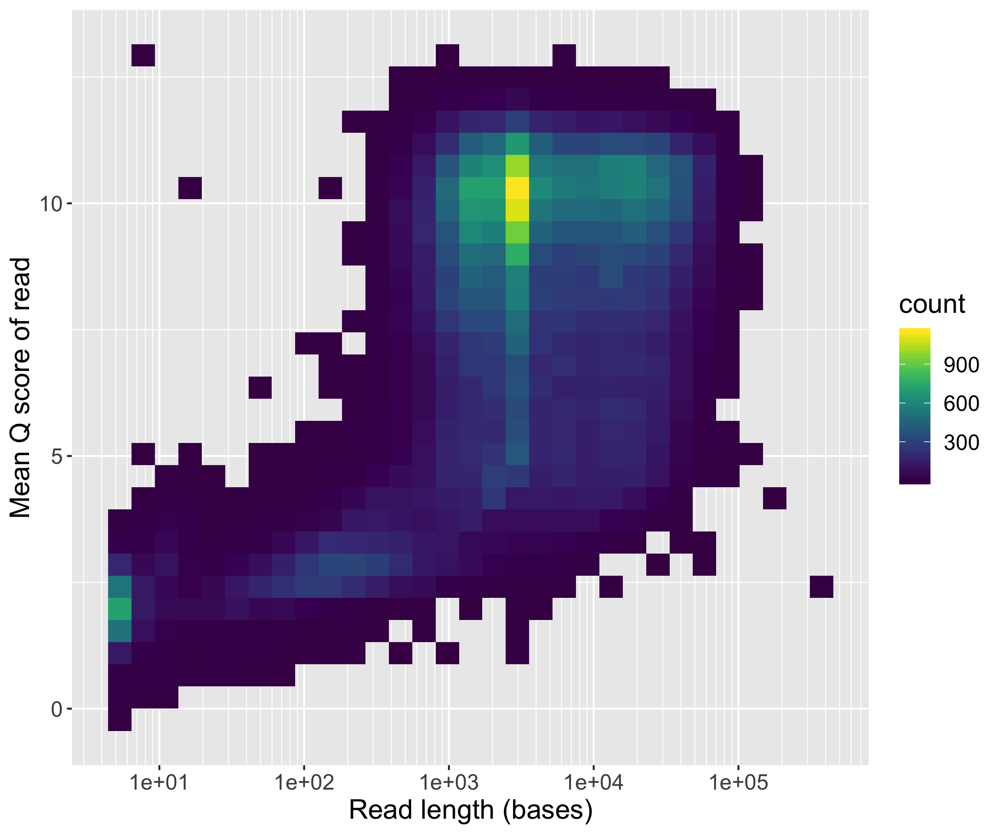

