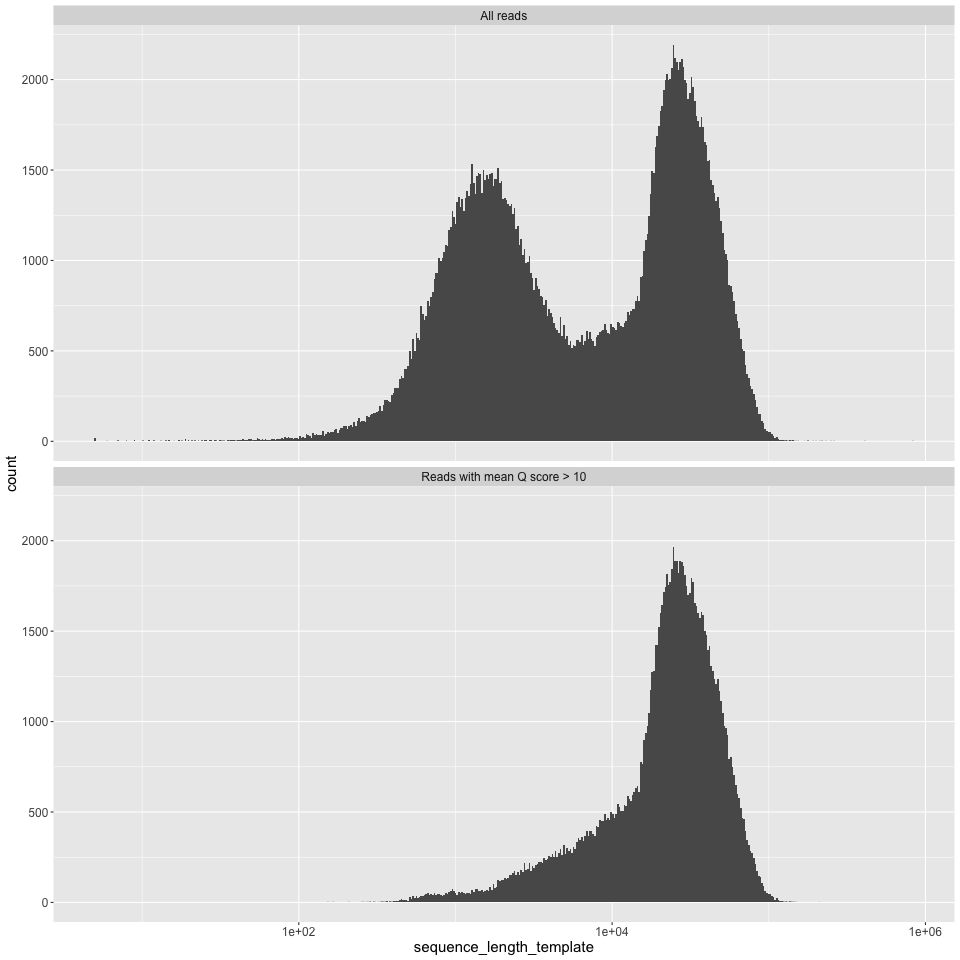
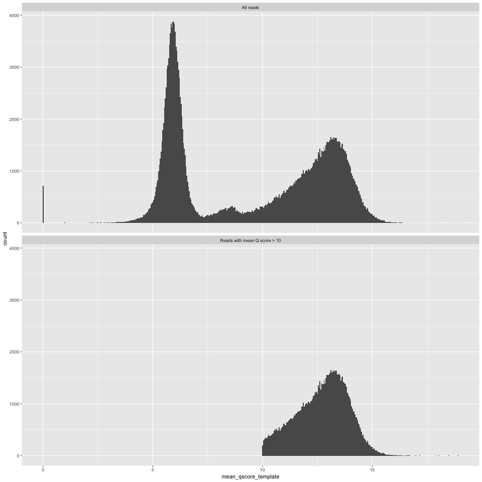
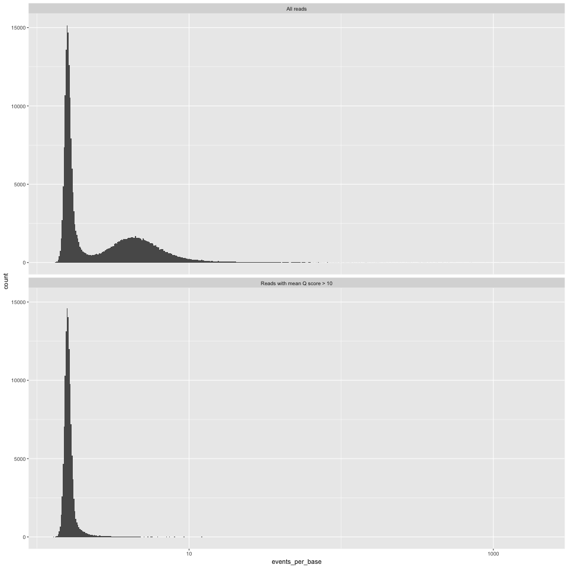
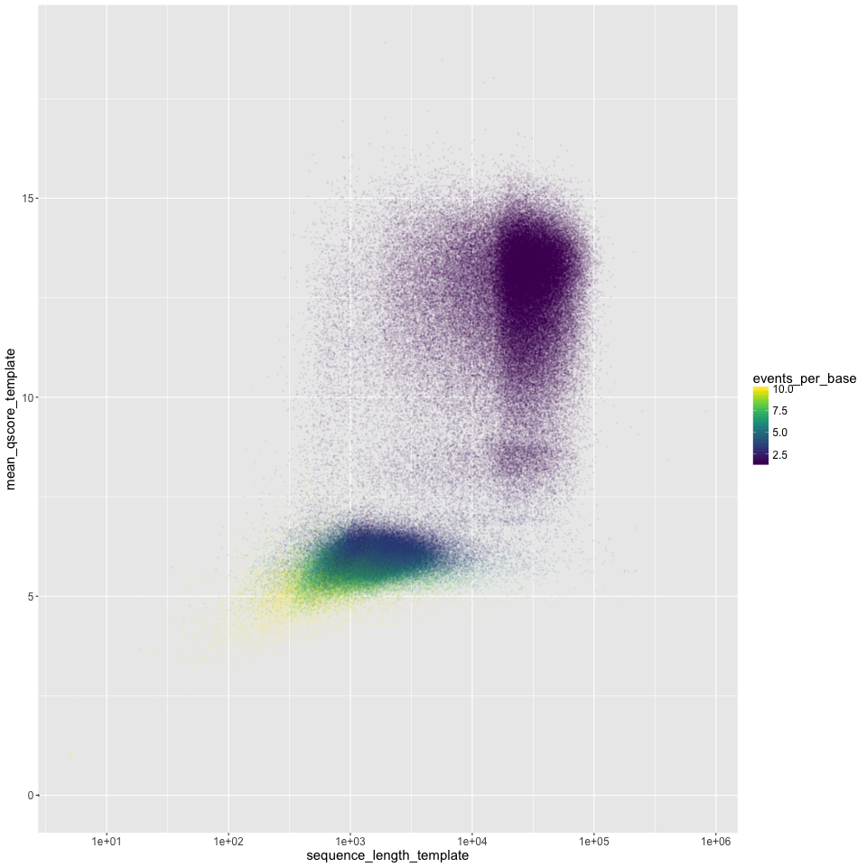
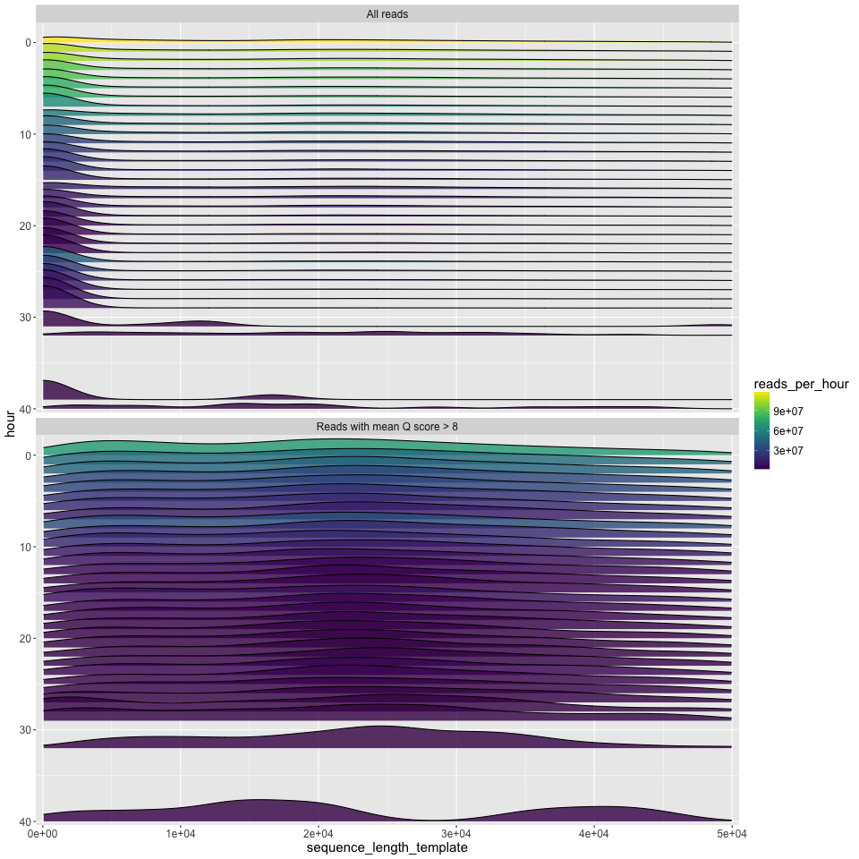
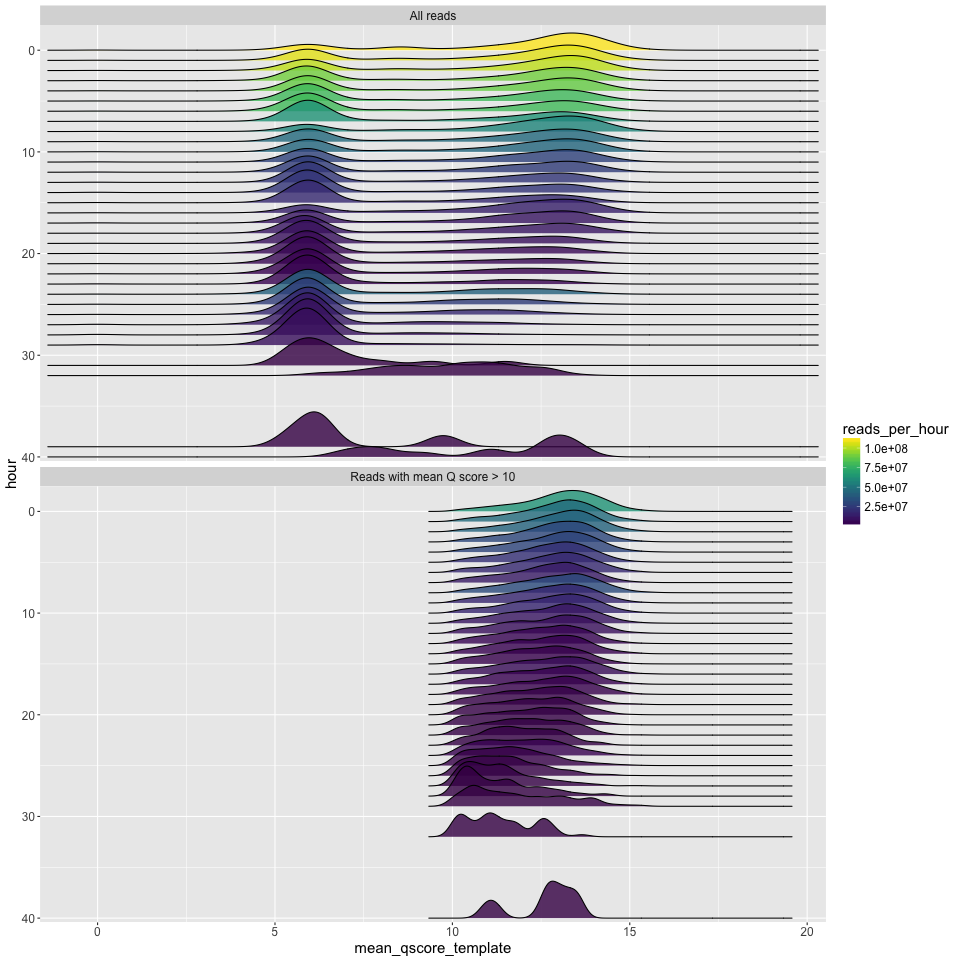
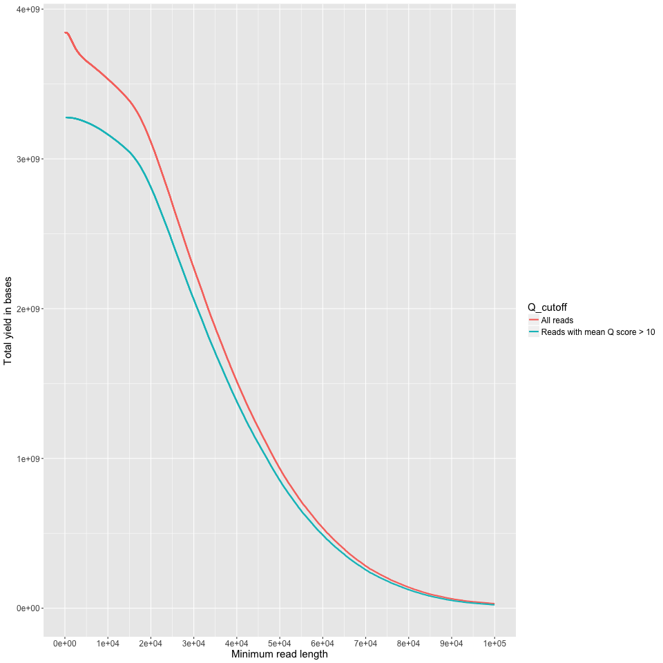
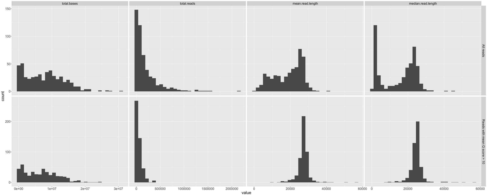
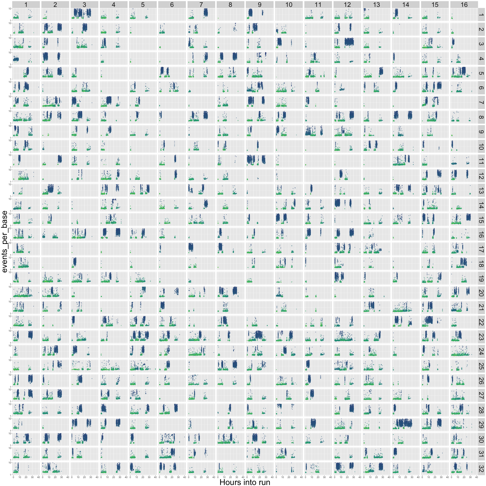
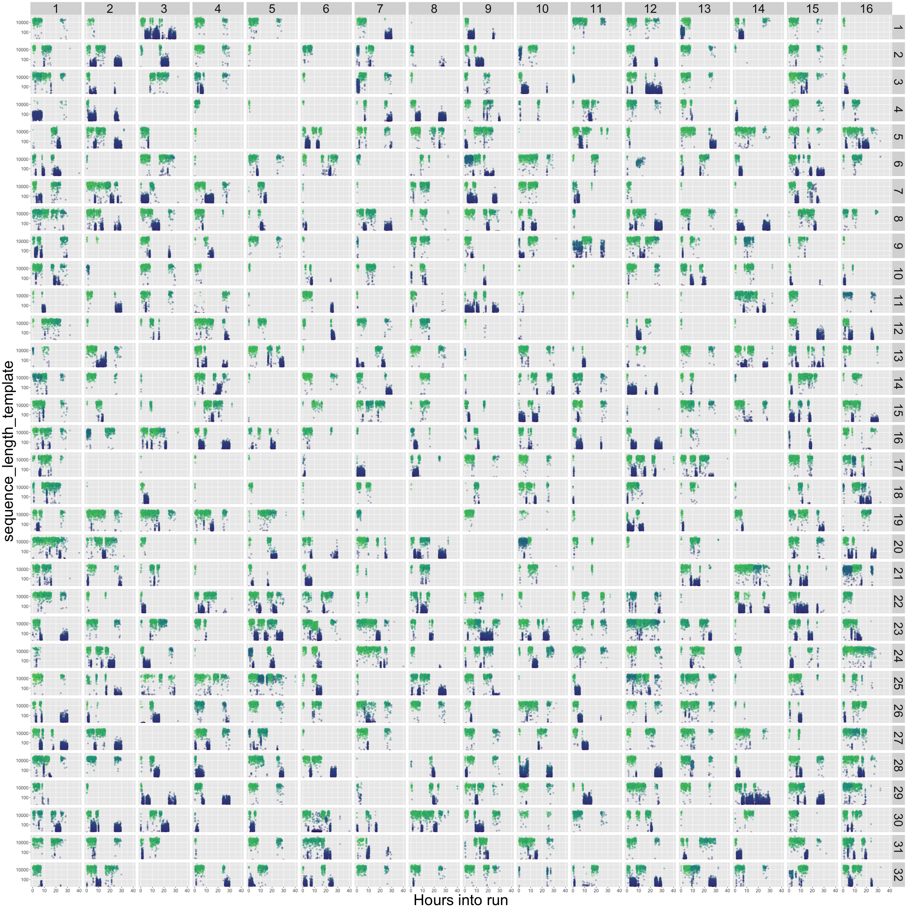

# Quality control for MinION sequencing data

## What?

An R script to do some basic QC on data from Oxford Nanopore's MinION sequencer, using the `sequencing_summary.txt` file from Albacore as input.

## Why?

Because other tools focus on getting data out of the fastq or fast5 files, which is slow and arduous. The benefit of this script is that it works on a single, small, .txt summary file. So it's a lot quicker than most other things out there: it takes about a minute to analyse a 4GB flowcell on my laptop. 

## Quick start

```
Rscript minion_QC.R sequencing_summary.txt output_directory q_score_cutoff
```

* *minion_QC.R*: path to this script
* *sequencing_summary.txt*: path to a sequencing_summary.txt file from Albacore
* *output_directory*: path to an output directory. Files will be overwritten.
* *q_score_cutoff*: a q_score cutoff value for reads that you might throw out. Albacore 2.0 defaults to 7 for this. On our data a value of 8 looks a little more sensible.

## Dependencies
A recent version of R, and install the following:

```
install.packages("ggplot2")
install.packages("viridis")
install.packages("reshape2")
install.packages("plyr")
install.packages("ggjoy")
install.packages("purrr")
install.packages("scales")
install.packages("data.table")
```

## Output details
More details on rationale are in [this blog post](robertlanfear.com/blog/files/nanopore_performance.html), example output is in the `/example_output` folder of this repository.

### summary.yaml

Simple text summary of the data in yaml format (opens in any text editor, but can also be read by any coding language). Ultralong reads are defined as the maximum possible fraction of the data that has an N50>100KB, following the definition given in [this preprint](biorxiv.org/content/early/2017/04/20/128835). Here's the first part of the example file:

```yaml
input file: ~/Desktop/sequencing_summary.txt
All reads:
  total.gigabases: 3.527993
  N50.length: 34625.0
  mean.length: 14797.3
  median.length: 5852.0
  max.length: 208407.0
  mean.q: 7.9
  median.q: 9.0
  reads:
    '>20kb': 80309
    '>50kb': 13325
    '>100kb': 181
    '>200kb': 1
    '>500kb': 0
    '>1m': 0
    ultralong: 390
  gigabases:
    '>20kb': 2.949691
    '>50kb': 0.8406423
    '>100kb': 0.0199968
    '>200kb': 0.0002084
    '>500kb': 0.0e+00
    '>1m': 0.0e+00
    ultralong: 0.0399325
```

### length_histogram.png
Read length, on a log10 scale, on the X axis, and read counts on the Y axis.


### q_histogram.png
Mean Q score for a read on the X axis, and counts on the Y axis. 


### epb_histogram.png
Events per base (i.e. numbe of events for each read, divided by the number of bases called for that read) on the X axis, and counts on the Y axis. We have found this measure to be potentially useful in finding dodgy reads, see robertlanfear.com/blog/files/nanopore_performance.html for more.


### length_vs_q.png
Read length (log10 scale) on the X axis, mean Q score on the Y axis. Points are coloured by the events per base. 'Good' reads are ~1.5 events per base, and 'bad' reads are >>1.5 events per base. We often see a group of very short 'bad' reads.


### length_by_hour.png
The read length density distribution (x axis) plotted for each hour of the run (y axis). Time runs from hour zero at the top, to the final hour of the run at the bottom. Since density plots do not intrinsically tell you anything about the number of reads, the number of reads is given by the fill colour. This can show some interesting patterns e.g.: that most of the good data in the run below came in the first ~10 hours; that the new mux at 8 hours led to a decent increase in the number of good reads; and that most of the longest good reads (>40kbp) also came in the first few hours.  


### q_by_hour.png
The q score density distribution (x axis) plotted for each hour of the run (y axis). Time runs from hour zero at the top, to the final hour of the run at the bottom. Since density plots do not intrinsically tell you anything about the number of reads, the number of reads is given by the fill colour.   


### yield_summary.png
Minimum read length on the X axis, and the yield of bases with reads at least that long on the Y axis. This is just like the 'reads' table in the `summary.txt` output, but done across all read lengths up to 100KB. I cut off at 100KB because you (probably) don't have most of your data at those lenghts. Good on you if you do though.


### channel_summary.png
Histograms of total bases, total reads, mean read length, and median read length that show the variance across the 512 available channels. Repeated for all data and reads with Q>10.


### flowcell_channels_epb.png
This one's busy, but hopefully useful. The 512 channels are laid out as on the R9.5 flowcell. Then each sub-panel of the plot simply plots out the time of the run in hours on the X axis, and the events per base (log scale, cut off at 10 events per base) on the Y axis. The colour is the mean Q score of each read - blue is low, green is high. This gives a little insight into exactly what was going on in each of your channels over the course of the run. Blow it up big! What you want is lots of green (high quality) reads, being consistently produced in each channel, and with a consistently low events-per-base score (Y axis, indicating that the reads are not stalling in the pores).


### flowcell_channels_readlength.png
As above, but now the read length is on the Y axis

